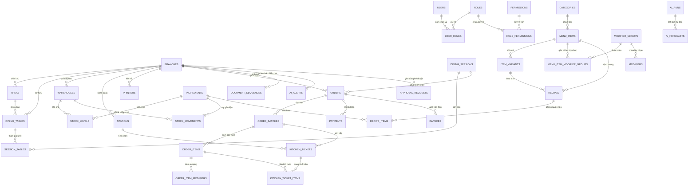
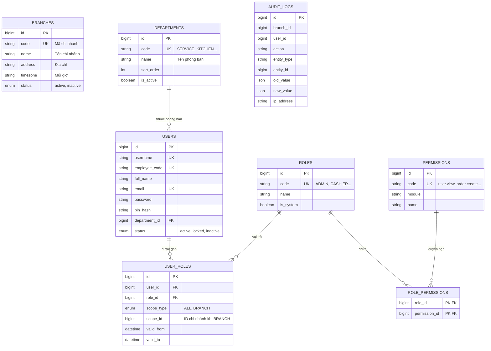
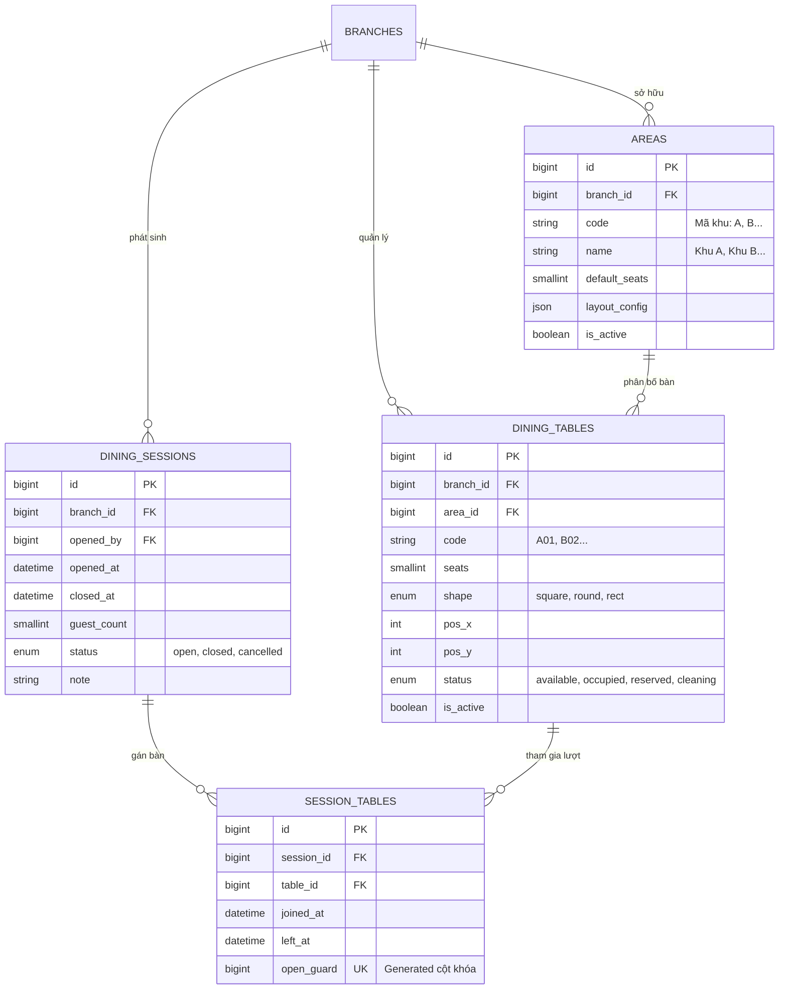
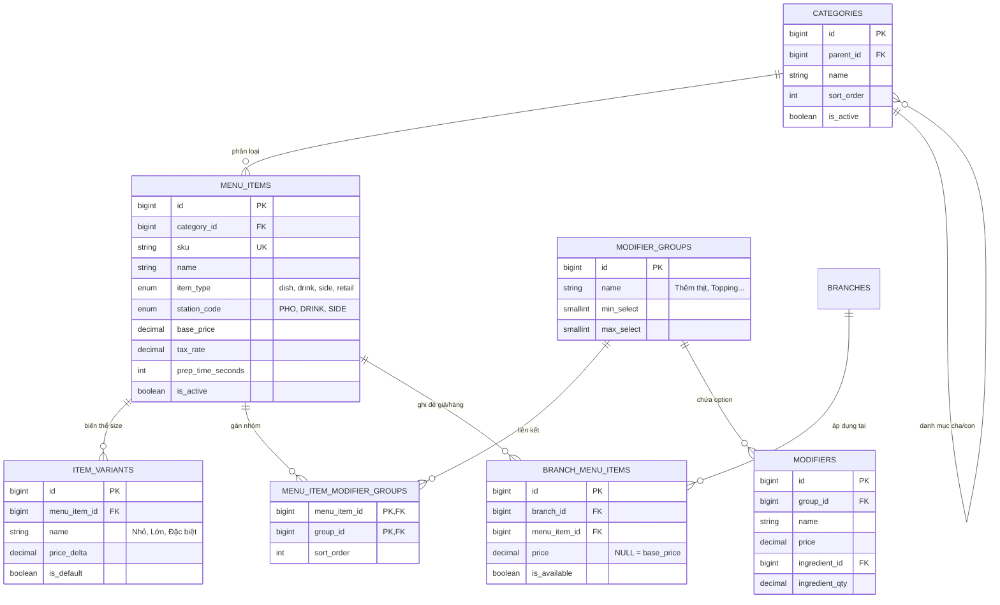
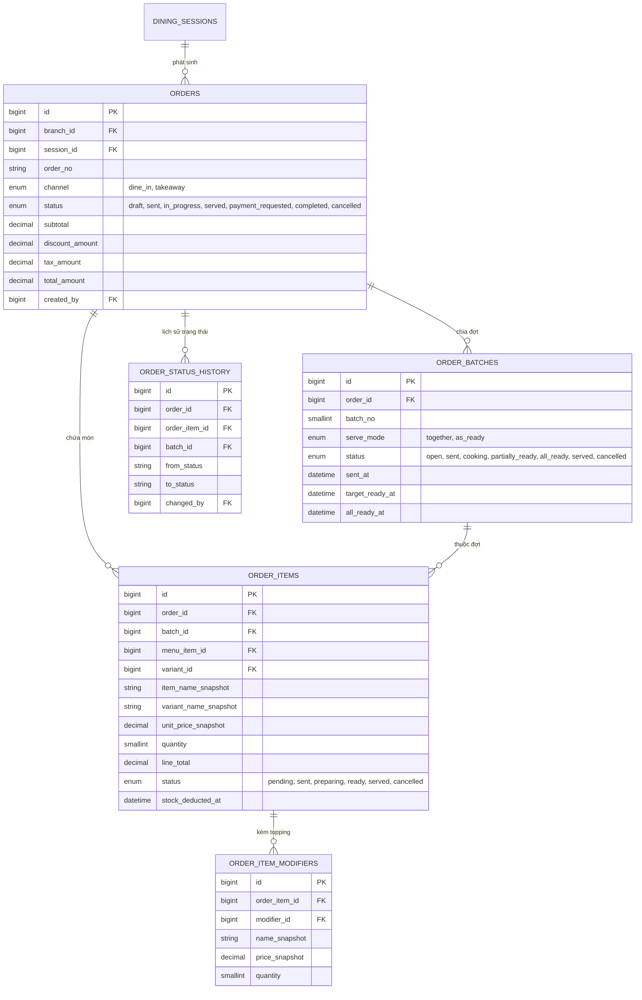
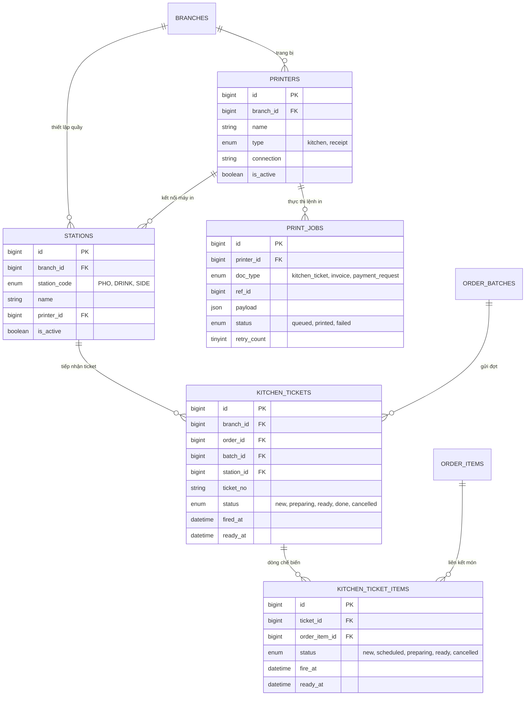
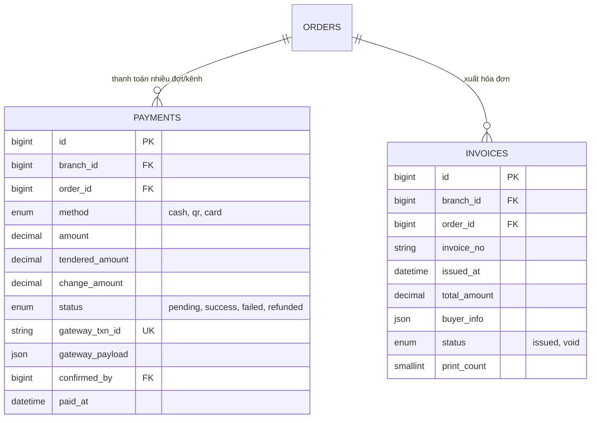
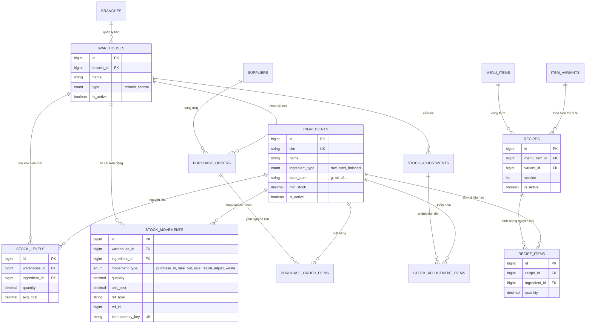
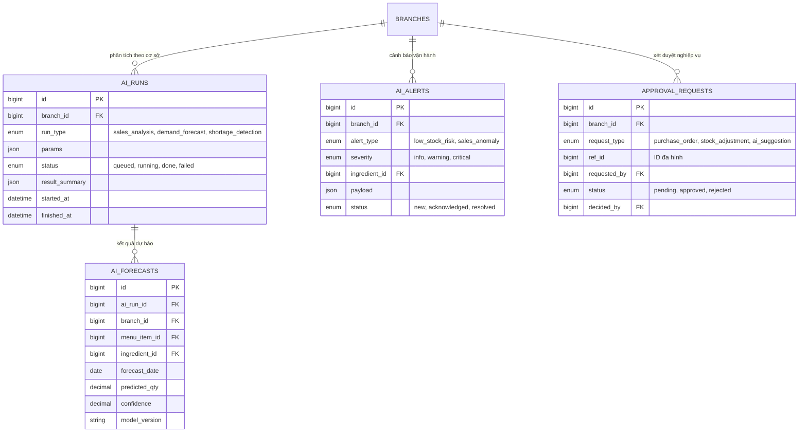
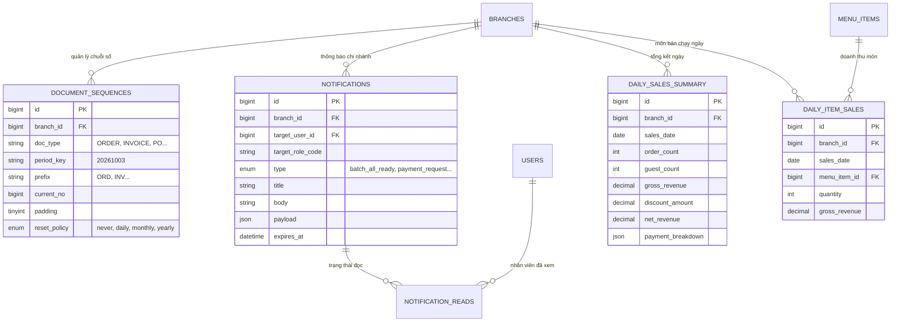

# SƠ ĐỒ QUAN HỆ THỰC THỂ (ENTITY RELATIONSHIP DIAGRAM - ERD)
**Hệ thống Quản lý Vận hành Chuỗi Quán Phở (MESA POS & Operation System)**

---

## 1. SƠ ĐỒ TỔNG QUAN HỆ THỐNG (SYSTEM OVERVIEW ERD)

Sơ đồ thể hiện luồng liên kết trung tâm giữa 9 phân hệ: **Tổ chức & Phân quyền**, **Bàn & Lượt dùng**, **Thực đơn**, **Gọi món (Order)**, **Bếp & KDS**, **Thanh toán**, **Kho & Định lượng**, **AI & Dự báo**, **Hạ tầng & Báo cáo**.

---

## 2. SƠ ĐỒ CHI TIẾT TỪNG PHÂN HỆ

### Nhóm A: Tổ chức và Phân quyền (Organization & Auth)

---

### Nhóm B: Bàn và Lượt Dùng Bữa (Table & Dining Session)

---

### Nhóm C: Thực Đơn & Tùy Chọn (Menu & Modifiers)

---

### Nhóm D: Gọi Món (Order & Order Batches)

---

### Nhóm E: Bếp, KDS và In Ấn (Kitchen, KDS & Printing)

---

### Nhóm F: Thanh Toán và Hóa Đơn (Payment & Invoice)

---

### Nhóm G: Kho, Định Lượng & Nhập Hàng (Inventory & Recipe)

---

### Nhóm H: AI, Dự Báo & Phê Duyệt (AI & Approvals)

---

### Nhóm I: Hạ Tầng, Thông Báo & Dashboard (Infrastructure & Reporting)

